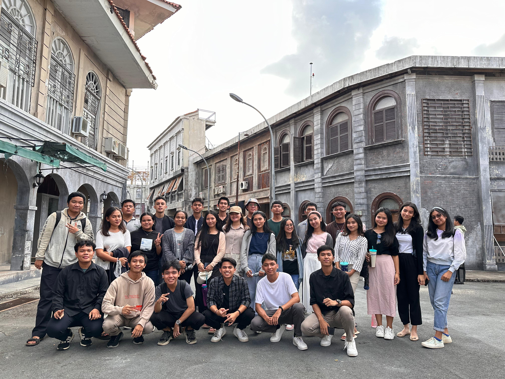
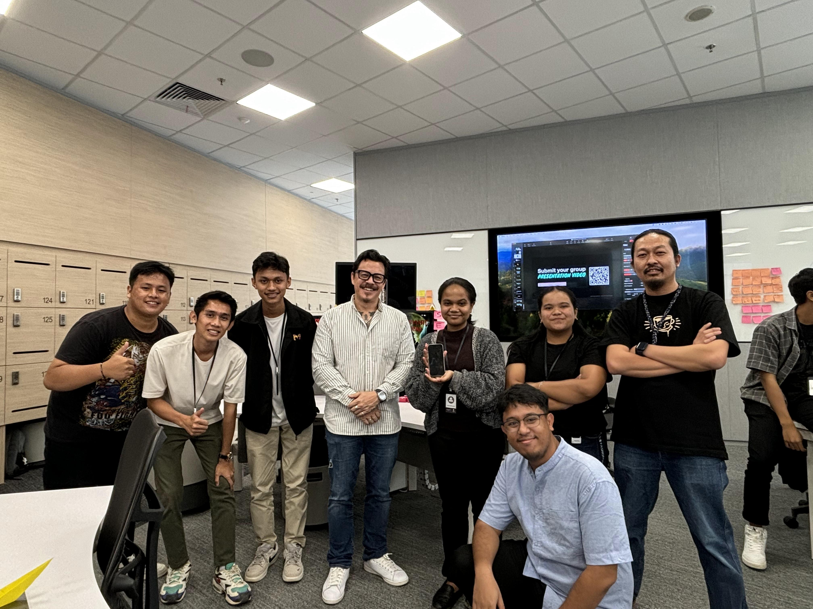

# Nightmare Seeker: iOS Game with Swift and SpriteKit

### Related to Apple Developer Academy @ Infinite Learning

*Nightmare Seeker* is an iOS game developed during the Apple Developer Academy @ Infinite Learning. The game incorporates advanced iOS development techniques, utilizing technologies like UIKit animations, responsive touch controls, and optimized code.

## Table of Contents
- [About the Project](#about-the-project)
- [Gameplay Elements](#gameplay-elements)
- [Technology Stack](#technology-stack)
- [Run Locally](#run-locally)
- [Authors](#authors)
- [Demo](#demo)

## About the Project
*Nightmare Seeker* invites players into a chilling, atmospheric world filled with terrifying challenges. Players use tilt-based mechanics to control their characters by tilting their device left or right. The game emphasizes calmness and composure, as excessive movement can lead to a game over.




## Gameplay Elements

This game is more than just an obstacle-avoidance experience. It integrates emotional elements centered around maintaining 'calmness'. Players face unexpected surprises and fear-inducing challenges while navigating through the game world. Moving the device too quickly will result in a game over, so staying calm under pressure is essential.

## Technology Stack

The development of *Nightmare Seeker* leverages various Apple technologies, showcasing:
- **Swift**: Main programming language used.
- **SpriteKit**: For creating 2D animations and handling the game logic.
- **UIKit**: For integrating animations and responsive touch controls.
- **Challenge Based Learning (CBL)**: Approach followed during development.

## Run Locally

To run the project locally, follow these steps:

1. Clone the project repository:
    ```bash
    git clone https://github.com/khensin166/Nightmare-Seeker.git
    ```

2. Navigate to the project directory:
    ```bash
    cd Nightmare-Seeker
    ```

3. Open the project in Xcode and run the project:
    ```bash
    Command+R
    ```

## Authors

- [@Exaudi Siregar](https://github.com/khensin166)
- [@Sion Pardosi](https://github.com/khensin166)
- [@Cecilia Situmorang](https://github.com/khensin166)
- [@Anastasya Marpaung](https://github.com/khensin166)
- [@Kenan Tomfie Bukit](https://github.com/khensin166)

## Demo

Demo coming soon!

---

*Skills:* SpriteKit · UIKit · Swift (Programming Language) · iOS Development
