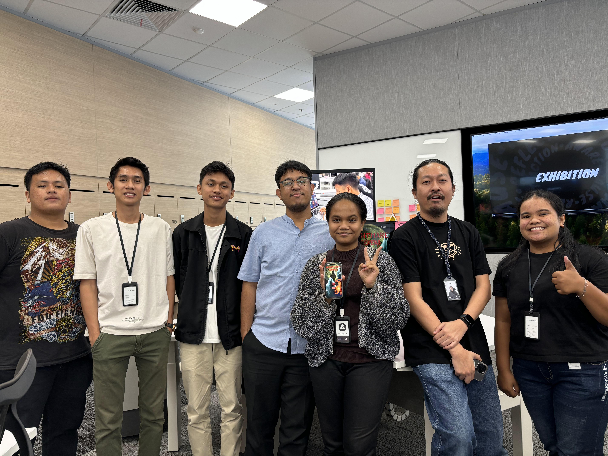

# Nightmare Seekers - iOS Game with Swift and SpriteKit

Repositori ini berisi source code game **Nightmare Seekers** yang dibuat dengan teknologi berbasis iOS selama mengikuti program Apple Developer Academy @Infinite Learning, Batam, Indonesia.





## Tentang Proyek

**Nightmare Seekers** adalah perjalanan mendebarkan ke dunia yang dipenuhi dengan tantangan dan rintangan menakutkan. Game ini memanfaatkan teknik-teknik modern dalam pengembangan game iOS, termasuk:

- **Animasi UIKit**: Membuat pengalaman yang lebih hidup dan dinamis.
- **Kontrol Sentuh Responsif**: Memudahkan pemain untuk bergerak dengan lancar.
- **Pengkodean yang Efisien**: Menjamin performa optimal di perangkat iOS.

## Elemen Gameplay

Tidak hanya sekadar menghindari rintangan, game ini juga mengajak pemain untuk menjaga ketenangan di tengah ketegangan. Pemain harus menghadapi kejutan dan ketakutan, sambil tetap tenang agar tidak kalah! 💪

## Teknologi dan Keterampilan

Kami menggunakan kombinasi teknologi seperti **Swift**, **SpriteKit**, dan **UIKit** untuk menciptakan pengalaman bermain yang menarik. Pendekatan **Challenge Based Learning (CBL)** mendasari pengembangan keterampilan dalam pengkodean, desain, dan pengembangan perangkat lunak Apple.

## Kesimpulan

Proyek **Nightmare Seekers** tidak hanya menyajikan pengalaman bermain yang menarik secara visual, tetapi juga menunjukkan kemajuan signifikan dalam penguasaan teknologi Apple. Proyek ini memberikan wawasan yang mendalam tentang pengembangan aplikasi iOS dan keterampilan yang diperlukan dalam industri game saat ini.

## Keahlian yang Dikembangkan

- **SpriteKit**
- **UIKit**
- **Swift (Bahasa Pemrograman)**
- **Pengembangan iOS**

## Run Locally

Clone the project:

```bash
git clone https://github.com/khensin166/Nightmare-Seeker.git
